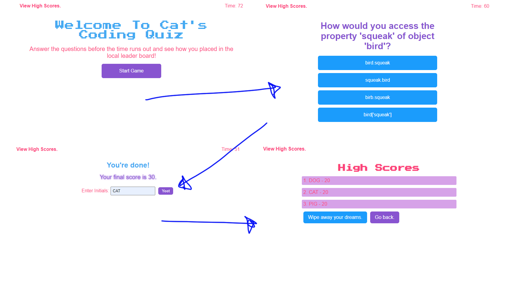

# Cat's Uber Fantastic Quiz Page

Here is a direct and working URL to my active website.

[Click here for the quiz website!](https://cat-lin-morgan.github.io/code-quiz/ "Cat's Quiz Game")

## Acceptance Criteria

This game allows the player to take a Javascript Quiz!

Game starts on button click and off goes a timer!

The game loops through several questions. 

When the player answers incorrectly time is taken from the player.

When the player answers all questions or the timer runs out then the player is prompted with the option to enter their initials and to save their high score.

Both initials and player's high score are added to local storage.

They are all retrieved on the highscore page.

Please enjoy my game!

---

**Thank you for viewing.**

